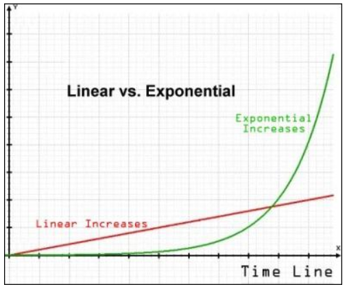

layout: page
title: "crypto is totally fine for the world really"
permalink: /crypto-is-totally-fine-for-the-world-really/

## Introduction

A common refrain you hear from crypto enthusiasts is that crypo doesn't have a large carbon footprint or that the banks are just as bad. The purpose of this page is to accurately scope the size of electrical consumption of crypto and to see how it compares relative to the current financial industry's footprint.

## Assumptions

When pulling estimates, I'll be erring on the side that benefits crypto so that my final argument will be the best case for crypto. This will hopefully show that this isn't sustainable even if we give miners the best case scenario.

## What coins are we talking about?

The [current market cap for crypto](https://coinmarketcap.com/) (basically how much money is in the space) is approximately 2.3 trillion dollars. This changes all the time, but it will give us a good starting point about what the most popular coins are and how much electricity is being consumed.

At time of writing, here are the top 5 coins in order by market cap (this essentially shows how much equity used)

1. Bitcoin - $927,825,526,790

2. Ethereum -$478,338,031,267

3. Binance Coin - $88,995,809,060

4. Tether - $76,259,754,569

5. Solana -$57,225,840,195
	
These coins make up about 70% of all crypto investments, full stop. ((.927 + .478 + .088 + .076 +.057)/2.3)

The top 2 coins which I'll be focus on will be Bitcoin (BTC) and Ethereum (ETH) represent 61% ((.927+.478)/2.3) of all crypto in this space and I'll be assuming that they are 100% responsible for all the pollution so that in the best case all other crypto has no effect on electricity usage. People may balk at this because there are better coins than ETH or BTC, but we're picking the vast majority of where crypto wealth lies and where the lion's share of transactions are occurring.

## What are Transactions Per Second? (TPS)

Transactions per second (called tps from now on) basically indicate how many individual trades or transfers that can happen in a second. If you and I were trading a baseball card and it took us two seconds, our speed would be 0.5 tps.

Transactions are a big deal in terms of financial networks. They're basically the limit on how many things can happen, and how long you have to wait to pay someone or get paid. 

Here are some numbers for various merchants or crypto coins and their TPS
1) [Visa](https://news.bitcoin.com/no-visa-doesnt-handle-24000-tps-and-neither-does-your-pet-blockchain/) - 1700 TPS

2) [Bitcoin](https://thecryptowings.com/transactions-per-second-tps-in-crypto/) - 7 TPS*

3) [Etheruem](https://ethereum.stackexchange.com/questions/28666/whats-the-transaction-throughput-on-ethereum-how-fast-the-nodes-can-replicate) - 10-30 TPS**

\* Bitcoin has the [lightning network](https://www.bitdegree.org/crypto/tutorials/lightning-network#how-does-the-lightning-network-work), which does greatly increase transaction speed (up to a claimed 10,000 tps) but this second layer still requires the base blockchain to function which is tied to the above speed.

\** Ethereum is looking at launching (Ethereum 2.0)[https://ethereum.org/en/eth2/] which would significantly increase the throughput of the network, but I cannot find any dates closer than 2023 on when this would happen. It should happen, Proof of Stake (PoS) empirically has a lower net effect on the environment and energy consumed but until it happens I'm going to say it's 30 TPS.

The speeds we use for the coins will be maximum, and it has been found that TPS significantly slows down when the networks become "clogged."

## Next steps

Okay, so we now have how fast the networks "move" and now we want to focus on the yearly energy consumption for the above systems. To do this, we can use how much profit miners are getting. Once we understand this, we can work out how much energy is used to run these networks and correlate this to an approximate amount of pollution through burning coal, oil, or natural gas.

## Bitcoin energy cost needed

So, without digging into how the blockchain [works](https://medium.com/swlh/the-bitcoin-blockchain-explained-b4529c78e6af) too deeply, you need computing power and electricity to make blocks on the chain. A helluva a lot of it. If you can manage to make a block, it can be quite lucrative.

In 2021, a conservative [estimate](https://finbold.com/bitcoin-miners-earn-57-million-in-average-profits-daily/) of daily revenue from miners is about 50 million dollars. It ranges from the year between 40-60 million, so I'm splitting the difference.

So we know about how much money miners make, but what do they spend proportionally on electricity? Well, this number is incredibly varied, but I'm going with the assumption of 50% based on [this](https://medium.com/capriole/bitcoins-production-cost-88d889462ea7#:~:text=%20From%20Cambridge%E2%80%99s%20electricity%20consumption%2C%20Bitcoin%E2%80%99s%20Production%20Cost,Electrical%20Cost%29%20%2F%20%28Daily%20Cost%20of...%20More%20) article and giving the miners some leeway on cost.

Putting these numbers together, (50,000,000 * .50) gives us an electricity cost of about $25,000,000 a day or about $1,000,000 per hour. But how much usage is this in terms of electricity? I'm going to go with the global average which is about $0.05 per kilowatt hour for bitcoin from [this](https://medium.com/capriole/bitcoins-production-cost-88d889462ea7#:~:text=%20From%20Cambridge%E2%80%99s%20electricity%20consumption%2C%20Bitcoin%E2%80%99s%20Production%20Cost,Electrical%20Cost%29%20%2F%20%28Daily%20Cost%20of...%20More%20) article.

1,000,000 dollars per hour / (.05 dollars per kilowatt hours) = 20,000,000 kilowatts

20,000,000 kilowatts * 24 hours * 365 days = 175,200,000,000 kilowatt hours per year = 175.2 Terawatt hours per year

This is a big number, but what does it mean? So, for scale this means that all of bitcoin alone uses as much electrity per year as [Poland](https://yearbook.enerdata.net/electricity/electricity-domestic-consumption-data.html) did in 2020. And this is a low estimate.

But before you crack your knuckles and write a response to me about "the financial system burns a bunch of electricity too!" Well...we're getting to that. But first we're going to do Ethereum.

## Ethereum 

[Average](https://www.theblockcrypto.com/linked/104583/ethereum-eth-miners-making-more-bitcoin-btc-miners) Daily Revenue of miners: $70,000,000

percentage cost for electricity from above: 50%

Electricity Cost per day = (70,000,000 * .5) = $30,000,000

Electricity Cost per hour = $1,250,000

[Kilowatt hour cost](https://digiconomist.net/ethereum-energy-consumption#:~:text=The%20only%20difference%20between%20the%20two%20indices%20is,that%20Ethereum%20runs%20Ethash%2C%20an%20%E2%80%9CASIC-resistant%E2%80%9D%20proof-of-work%20algorithm.) = $0.10 (this is more since ETH runs a different algorithim than BTC, see the link)

1,250,000 / .10 = 12,500,000 kilowatts of electriticy per hour

12,500,000 * 24 * 365 = 109,500,000,000 kilowatts per yer = 109.5 terawatts per year

Again, this is comparable to the energy output of [The Netherlands](https://yearbook.enerdata.net/electricity/electricity-domestic-consumption-data.html) in 2020.

## Total Crypto Electricity Consumption (approximately)

So putting these two numbers together, we get 284.7 TW/h of electricity consumption. This is ignoring all other crypto, using estimates that benefit crypto's side, and even so we still get the combined power output that's more than all of Mexico.

Also keep in mind this consumption will continue to increase year after year as adoption and mining complexity increases.

This is to facilitate approximately 40 transactions per second. Now we're next going to dive into the approximate cost for Visa and talk about value that both of these systems provide.

## How much energy does Visa consume?

This article is getting very long, and I'm honestly having trouble finding a good estimate like we did with crypto. So let's go worst case and go with various crypto articles estimates.(ignoring the fact that back in 2017 BTC and ETH used a lot less electricity ;) ) This should give us a good target to estimate from.

[estimate 1](https://hackernoon.com/the-bitcoin-vs-visa-electricity-consumption-fallacy-8cf194987a50): 100 TW/hr

[estimate 2](https://bitsonline.com/bitcoin-vs-banks-uses-energy/#:~:text=There%20are%20a%20lot%20of%20middlemen%20in%20the,terawatts%20of%20power%20consumed%20by%20banks%20each%20year.): 100 TW/hr

[estimate 3](https://www.ledger.com/energy-consumption-crypto-vs-fiat): 100 TW/hr

So, we're getting a back of the napkin estimate to around similar to Ethereum. Oh no, what do we say about this? Is the argument destroyed? Am I a bitter "no-coiner" who doesn't see the future? Read on to find out.

## The section where my argument is not destroyed

Some things to keep in mind as we go forward. Banking infrastructure does not suffer the same exponential growth problem that crypto does. It is a high number, yes. but that number grows linearly at best. This is the difference between something taking 100 years to go from 0-100 adding 1 every year vs taking 49 years to get there with exponential growth. (This is dependent on the growth rate which I put at 10%, don't @ me. If you want crypto to succeed, it'd be an exponential growth rate around 10% growth per year)

See this pretty chart I didn't steal:

But who cares about algebra? Let's talk about utility. Remember 200 years ago when I talked about transactions per second?

This is the relative utility these networks provide in regards to percentage of transactions:

Blue is Visa, gold is ETH, red is BTC. "Okay, wow you showed that we need more people using crypto." Not really, remember as adoption grows so does electricity consumption as network speed decreases.

This is the contribution of each network to electricity consumption and by extension climate change:

BTC and ETH combined take up about 75% of the electricity we calculated and contribute to around 2% of transactions.

These crypto numbers will grow year after year, more and more tons of coal will be burnt to support this technology until something changes. The majority of all crypto mining for BTC and ETH currently happen in China for various reasons and China is one of the leading contributers for pollution and climate change due to their high dependence on coal and natural gas. 

This is the core of the argument, is this value we get from crypto worth the carbon released into the atmosphere?

47.7 Mega tons of CO2 for [ETH](https://digiconomist.net/ethereum-energy-consumption) and 95.95 Mega tons of CO2 for [BTC](https://digiconomist.net/bitcoin-energy-consumption). This is not sustainable and anyone who pretends otherwise is honestly just incorrect as I hope I've shown here. 

## Outro

Thanks for reading this, I'm going to have some things at the that I'm guessing crypto bros will argue with and my responses to those points. I'll add more pages with different arguments as I can. 

Please feel free to share ot people you're arguing with or help contribute!!

## Things I'm guessing people will have problems with

* __But this isn't all of crypto, you cherry picked the worst coins! Here are some altcoins that are eco-friendly.__
  - I don't care about your altcoin. I picked the biggest movers in the space, and until they are unseated as the top coins or they significantly reduce their footprint my opinion will not change
* __You didn't include Amex, Mastercard, etc!__
  - Yep, if I did the ending chart would still be nearly identical. I used Visa as it's the banking protocol that pro crypto articles used and it's the one that had the most reliable data. Energy consumption is high, and we should reduce it where we can. We shouldn't add more waste for such a small gain in regards to transactions.
* __But decentralization is important! You should use crypto for...__
  - Just because something is decentralized does not mean it's equitable or fair to everyone. I'm going to make a post on this later.
* __Lightning Network doesn't work like that, it saves so much!__
  - DYOR buddy, it does. It still requires the main blockchain and I really doubt miners will stop chasing profits to mine BTC and keep using the inefficient and slow backend to pump CO2 into the atmosphere
* __ETH 2.0 is coming soon, it will fix this!__
  - Eth 2.0 has been a few months away since at least 2017, if it comes..cool. Let's make all of crypto use less energy if we can. If that happens, I'll re-evaluate my position
* __You are wrong on your math!__
  - I hope not, if I was I'll re-adjust. I think I was pretty fair with my estimates and variables trying to make a stronger case for crypto, but I'll change my opinion or my math depending on how incorrect I am. My estimates seem to match up with multiple independent sources I linked throughout the article.